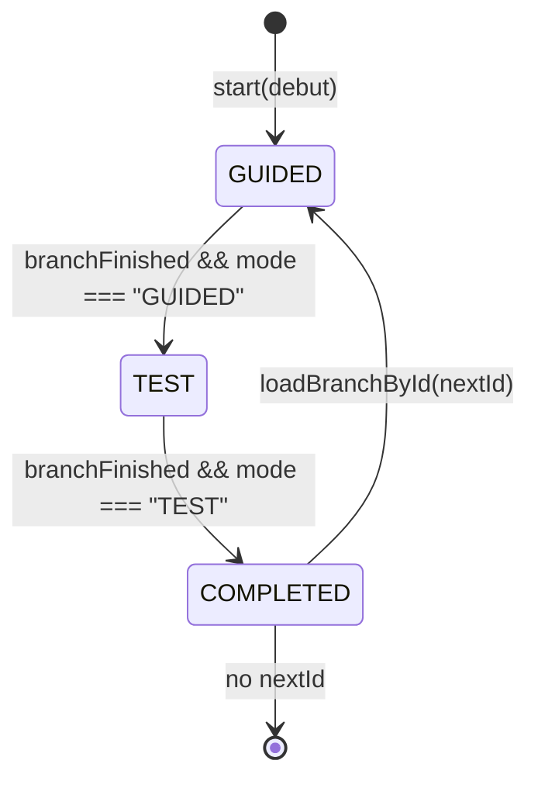
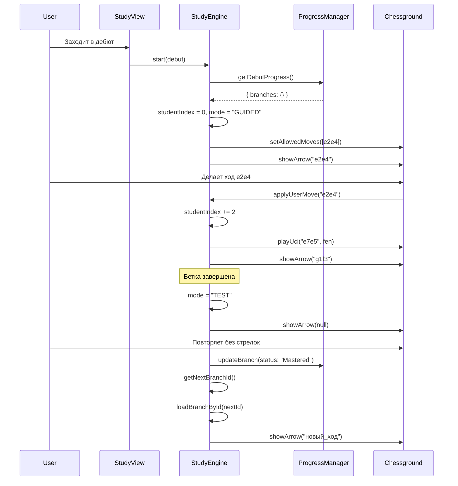

# Аудит системы веток и зелёных стрелок DebutLab

## 0) РЕЗЮМЕ

### Библиотека доски
**Активная библиотека**: `@lichess-org/chessground` (версия не указана в package.json)
**Инициализация**: `src/board/chessground.ts:L42` - `const ground = Chessground(opts.el, buildConfig())`
**Адаптер**: `createChessgroundBoard()` в `src/board/chessground.ts:L33-271`

### Определение ветки
**Структура**: `Branch` интерфейс в `src/content/types.ts:L35-42`
- `id: string` - уникальный идентификатор
- `type: "main_line" | "alternative"` - тип ветки
- `name: string` - описание ветки
- `startFen: "startpos" | string` - начальная позиция
- `ucis: string[]` - массив ходов в UCI нотации
- `minPly: number` - минимальное количество полуходов

**Регистрация**: Ветки загружаются из JSON файлов в `public/content/demo/` через `src/content/loader.ts`

### Переключение веток
**Алгоритм**: `src/study/study-engine.ts:L481-494` - `getNextBranchId()`
1. Находит первую непройденную ветку (status !== "Mastered")
2. Переход происходит в `src/study/useStudyEngine.ts:L185-200` - `handleBranchCompletedAndMaybeGoNext()`

### Зелёные стрелки
**Условие показа**: `src/study/useStudyEngine.ts:L24`
```typescript
const showArrow = studyEngine.getState().mode === "GUIDED" && u && !studyEngine.isMoveLearned(u);
```
**Реализация**: `src/board/chessground.ts:L104-113` - `showArrow()` использует `ground.setAutoShapes()`

### Хранение прогресса
**Ключ LocalStorage**: `'debutlab.v1'` в `src/study/progress-manager.ts:L3`
**Схема**: `UserProgress` интерфейс в `src/content/types.ts:L57-60`
- `debuts: Record<string, DebutProgress>` - прогресс по дебютам
- `learnedMoves: Record<string, string[]>` - изученные ходы

### Точки риска
1. **Смешение индексов**: `studentIndex` vs `nextHalfMove` в `StudyEngine`
2. **Асинхронность**: `updateArrowAndDests()` вызывается до обновления FEN
3. **Дублирование логики**: `getNextBranchId()` в `ProgressManager` и `StudyEngine`
4. **Отсутствие миграций**: версионирование прогресса не реализовано

## 1) КАРТА ФАЙЛОВ И ТОЧЕК ВХОДА

| Путь файла | Роль | Ключевые экспорты | Кем вызывается |
|------------|------|-------------------|----------------|
| `src/main.tsx` | Точка входа | ReactDOM.render | Браузер |
| `src/app/router.tsx` | Роутинг | `router` | `main.tsx` |
| `src/pages/StudyView.tsx` | UI изучения | `StudyView` | Роутер |
| `src/study/useStudyEngine.ts` | React хук | `useStudyEngine` | `StudyView.tsx` |
| `src/study/study-engine.ts` | Логика движка | `StudyEngine`, `studyEngine` | `useStudyEngine.ts` |
| `src/study/progress-manager.ts` | Управление прогрессом | `ProgressManager`, `progressManager` | `study-engine.ts` |
| `src/board/chessground.ts` | Адаптер доски | `createChessgroundBoard` | `ChessBoard.tsx` |
| `src/components/ChessBoard.tsx` | React компонент доски | `ChessBoard` | `StudyView.tsx` |
| `src/content/loader.ts` | Загрузка данных | `loadDebut`, `loadCatalog` | `StudyView.tsx` |
| `src/content/types.ts` | Типы данных | `Debut`, `Branch`, `UserProgress` | Все модули |

### Инициализация доски
**Создание**: `src/components/ChessBoard.tsx:L32-38`
```typescript
const api = createChessgroundBoard({
  el: boardRef.current,
  initialFen: startFen,
  orientation,
  onTryMove
});
```

**События хода**: `src/board/chessground.ts:L168-189`
- `movable.events.after` - основной обработчик хода
- `onTryMove(uci)` - callback в UI для валидации

## 2) ОПРЕДЕЛЕНИЕ «ВЕТКИ» И СХЕМА ДЕРЕВА

### Структура узла дерева
```typescript
interface Branch {
  id: string;                    // "ruy-lopez-0001"
  type: BranchType;              // "main_line" | "alternative"
  name: string;                  // "1.e4 e5 2.Nf3 Nc6 3.Bb5 a6 4.Ba4 Nf6"
  startFen: "startpos" | string; // "startpos" или FEN
  ucis: string[];                // ["e2e4", "e7e5", "g1f3", ...]
  minPly: number;                // 8
}
```

### Регистрация веток
**Манифест**: `public/content/catalog.json` - список дебютов
**Загрузка**: `src/content/loader.ts` - динамическая загрузка JSON файлов
**Порядок**: Определяется порядком в массиве `debut.branches`

### Выбор первой ветки
**Логика**: `src/study/study-engine.ts:L75-106` - `start(debut)`
```typescript
this.state.currentBranch = debut.branches[0]; // Первая ветка
```

## 3) ЛОГИКА ПЕРЕКЛЮЧЕНИЯ ВЕТОК (STATE/FLOW)

### Диаграмма состояний


### Алгоритм переключения
**Псевдокод** (из `src/study/study-engine.ts:L481-494`):
```typescript
getNextBranchId(): string | null {
  const prog = this.progressManager.getDebutProgress(this.state.currentDebut.id);
  const completed = new Set(
    Object.entries(prog.branches ?? {})
      .filter(([,v]) => v.status === "Mastered")
      .map(([id]) => id)
  );
  for (const b of this.state.currentDebut.branches) {
    if (!completed.has(b.id)) return b.id;
  }
  return null;
}
```

**Флаги прогресса**: `BranchStatus` в `src/content/types.ts:L5`
- `"New"` - новая ветка
- `"GuidedDone"` - пройдена с подсказками
- `"Review"` - на повторении
- `"Relearn"` - переобучение
- `"Mastered"` - освоена

## 4) ПРОГРЕСС ПОЛЬЗОВАТЕЛЯ

### Ключи LocalStorage
**Основной ключ**: `'debutlab.v1'` в `src/study/progress-manager.ts:L3`
**Чтение**: `src/study/progress-manager.ts:L20-39` - `loadFromStorage()`
**Запись**: `src/study/progress-manager.ts:L41-47` - `saveToStorage()`

### JSON-схема прогресса
```typescript
interface UserProgress {
  debuts: Record<string, DebutProgress>;     // прогресс по дебютам
  learnedMoves: Record<string, string[]>;    // изученные ходы
}

interface DebutProgress {
  [branchId: string]: BranchProgress;
}

interface BranchProgress {
  status: BranchStatus;        // статус ветки
  errors: number;              // количество ошибок
  nextReviewAt?: number;       // время следующего повторения
  lastAttemptAt?: number;      // время последней попытки
  learnedMoves?: string[];     // изученные ходы
  stage?: number;              // SRS стадия (0-3)
  completedAt?: number;        // время завершения
}
```

### Сброс прогресса
**Кнопка сброса**: `src/study/useStudyEngine.ts:L52-79` - `resetCurrentDebut()`
**Что обнуляется**: `src/study/progress-manager.ts:L62-65`
```typescript
resetDebut(debutId: string): void {
  this.progress.debuts[debutId] = this.getEmptyDebutProgress();
  this.save();
}
```

## 5) ЗЕЛЁНЫЕ СТРЕЛКИ — ИСТОЧНИК И ПРАВИЛА ПОКАЗА

### Библиотека стрелок
**Chessground**: `ground.setAutoShapes(shapes)` в `src/board/chessground.ts:L111`
**Структура**: `AutoShape` в `src/types/chessground.d.ts:L10-14`
```typescript
interface AutoShape {
  orig: Key;      // "e2"
  dest: Key;      // "e4"
  brush?: Brush;  // "green"
}
```

### Условия показа стрелки
**Точное условие** (из `src/study/useStudyEngine.ts:L24`):
```typescript
const showArrow = studyEngine.getState().mode === "GUIDED" && 
                  u && 
                  !studyEngine.isMoveLearned(u);
```

**Где снимаются**: `src/board/chessground.ts:L105-108`
```typescript
if (!uciOrNull) {
  ground.setAutoShapes([]);
  return;
}
```

### Важные флаги
- `mode === "GUIDED"` - режим с подсказками
- `!isMoveLearned(uci)` - ход не изучен
- `currentExpectedUci()` - ожидаемый ход не null

## 6) СЦЕНАРИЙ «С НУЛЯ → ПОВТОР → СЛЕД. ВЕТКА»

### Sequence Diagram


## 7) ТОЧКИ РИСКА / ВЕРОЯТНЫЕ ПРИЧИНЫ БАГОВ

### 1. Смешение индексов
**Файл**: `src/study/study-engine.ts:L40-42`
```typescript
private studentStart: 0 | 1 = 0;         // 0 — учимся за белых, 1 — за чёрных
private studentIndex = 0;                // номер шага ученика: 0,1,2...
private nextHalfMove = 0;                // глобальный индекс полухода в ветке
```
**Риск**: `studentIndex` и `nextHalfMove` могут рассинхронизироваться

### 2. Асинхронность обновления стрелок
**Файл**: `src/study/useStudyEngine.ts:L160-167`
```typescript
if (result.opponentUci) {
  boardApiRef.current?.playUci(result.opponentUci, studyEngine.getCurrentFen());
  await Promise.resolve(); // microtask, чтобы chessground обновил state
}
updateArrowAndDests();
```
**Риск**: `updateArrowAndDests()` может вызваться до обновления FEN

### 3. Дублирование логики выбора ветки
**Файл 1**: `src/study/progress-manager.ts:L146-201` - `getNextBranchId(debutId, branches)`
**Файл 2**: `src/study/study-engine.ts:L481-494` - `getNextBranchId()`
**Риск**: Разные алгоритмы выбора следующей ветки

### 4. Отсутствие миграций прогресса
**Файл**: `src/study/progress-manager.ts:L3`
```typescript
const STORAGE_KEY = 'debutlab.v1';
```
**Риск**: При изменении схемы прогресс может сломаться

### 5. TODO в критических местах
**Файл**: `src/study/useStudyEngine.ts:L203-204`
```typescript
// TODO: реализовать переход к следующей ветке
console.log('useStudyEngine: onNextBranch called');
```
**Риск**: Функция `onNextBranch` не реализована

### 6. Смешение SAN/UCI
**Файл**: `src/study/study-engine.ts:L155`
```typescript
const sanExp = this.uciToSanSafe(expected);
return { accepted: false, errorMessage: `Ожидался ход ${sanExp}` };
```
**Риск**: Сравнение ходов в UCI, но показ ошибки в SAN

## 8) ПРИЛОЖЕНИЯ

### Таблица функций
| Файл | Функция/метод | Назначение | Кто вызывает | Побочные эффекты |
|------|---------------|------------|--------------|------------------|
| `study-engine.ts` | `applyUserMove(uci)` | Обработка хода пользователя | `useStudyEngine.onMove` | Обновляет `studentIndex`, `currentFen` |
| `study-engine.ts` | `currentExpectedUci()` | Получение ожидаемого хода | `updateArrowAndDests` | Читает `studentIndex` |
| `study-engine.ts` | `getNextBranchId()` | Выбор следующей ветки | `handleBranchCompletedAndMaybeGoNext` | Читает прогресс |
| `useStudyEngine.ts` | `updateArrowAndDests()` | Обновление стрелок и ходов | `onMove`, `useEffect` | Вызывает `showArrow`, `setAllowedMoves` |
| `progress-manager.ts` | `updateBranch()` | Сохранение прогресса | `handleBranchCompleted` | Записывает в localStorage |
| `chessground.ts` | `showArrow(uci)` | Отображение стрелки | `updateArrowAndDests` | Вызывает `setAutoShapes` |

### Граф зависимостей
```mermaid
graph TD
    A[main.tsx] --> B[router.tsx]
    B --> C[StudyView.tsx]
    C --> D[useStudyEngine.ts]
    C --> E[ChessBoard.tsx]
    D --> F[study-engine.ts]
    D --> G[progress-manager.ts]
    E --> H[chessground.ts]
    F --> G
    F --> I[chess.js]
    H --> J[@lichess-org/chessground]
    C --> K[content/loader.ts]
    K --> L[content/types.ts]
    D --> L
    F --> L
    G --> L
```

### Глоссарий проекта
- **branch/ветка**: Отдельная линия дебюта с последовательностью ходов
- **line**: Синоним branch, используется в типах
- **hint/arrow/marker/shape**: Зелёная стрелка-подсказка на доске
- **mastery/progress**: Статус изучения ветки (New → GuidedDone → Review → Mastered)
- **studentIndex**: Индекс следующего хода ученика в массиве ucis
- **nextHalfMove**: Глобальный индекс полухода в ветке
- **GUIDED/TEST**: Режимы изучения (с подсказками/без подсказок)

### Ориентиры для поиска в коде
- **Доска/стрелки**: `Chessground`, `setAutoShapes`, `showArrow`, `drawGreenArrow`
- **Ветки/деревья**: `branch`, `ucis`, `studentIndex`, `currentExpectedUci`
- **Прогресс**: `progress`, `mastery`, `learnedMoves`, `localStorage`, `debutlab.v1`
- **События хода**: `onMove`, `applyUserMove`, `onTryMove`, `movable.events.after`
